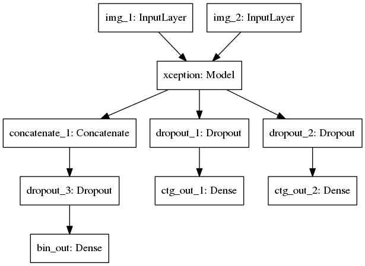

# 百度狗细粒度分类比赛

> 作者: [陈伟航](https://github.com/ahangchen)

如果觉得我的工作对你有帮助，就点个[star](https://github.com/ahangchen/keras-dogs)吧

Language: [English](README.md)/[简体中文](README_cn.md)

## 关于
比赛链接: http://js.baidu.com/

## 框架
- [Keras](https://keras.io/)
- [Tensorflow后端](https://www.tensorflow.org/)

## 硬件
- Geforce GTX 1060 6G
- Intel® Core™ i7-6700 CPU
- Memory 8G

## 模型
- [Xception](https://arxiv.org/abs/1610.02357)提取深度特征

[Xception结构图](doc/large_img.md##Xception)

- 受[这篇Person Re-id论文](https://arxiv.org/abs/1611.05666)的启发,在多分类基础上增加一个样本是否相同判断的二分类loss,增加类间距离,减小类内距离

### Keras实现
- 去掉Xception最后用于imagenet分类的全连接层,获取图像深度特征
- 输入两张图片,可能属于相同类也可能属于不同类
- 根据特征和标签进行多分类训练
- 同时以两图是否属于同一类作为二分类标签训练

## 数据预处理
- 从Baidu云下载数据
  - 训练集: http://pan.baidu.com/s/1slLOqBz Key: 5axb
  - 测试集: http://pan.baidu.com/s/1gfaf9rt Key：fl5n
- 按类别把图片放在不同的目录下，方便ImageDataGenerator的使用
- 因为先前我把图片命名为这种格式"typeid_randhash.jpg"了, 所以我写了这段代码来做图片移动的工作[img2keras.py](preprocess/img2keras.py)
- 数据预处理还有许多细节要处理，遇到问题的话可以先查看keras的文档，如果还有问题，可以提[issue](https://github.com/ahangchen/keras-dogs/issues).

## 训练
- 使用Keras的ImageDataGenerator接口进行数据增广
- 同时使用ImageDataGenerator做数据增广并进行正负样本对采样是一个难点.因为从ImageDataGenerator获得的图片被打乱了.
遍历数据集找同类样本作为正样本效率很低,幸运的是,在每个batch中,存在同类的样本,所以我们可以通过在同一个batch中交换同类样本的位置,构造出包含正样本对的另一个输入.
- 冻结Xception的卷积层,采用ADMM训练多分类和二分类模型.
- 解冻Xception卷积层的最后两个block(总共有12个block,最后两个block从Xception的105层开始)继续使用SGD训练
- 去掉数据增广,再训练直至收敛

## 代码
- 单一Xception模型
  - 训练: [single_model.py](single/single_model.py)
  - 测试: [single_model_test.py](single/single_model_test.py)
- Multi loss模型
  - 冻结训练全连接层+微调卷积层: [froze_fine_tune.py](xception/froze_fine_tune.py)
  - Trick微调: [trick_tune.py](xception/trick_tune.py)
  - 测试: [baidu_dog_test.py](xception/baidu_dog_test.py)

## 一些测试结果
- InceptionV3,多分类模型: 0.2502
- Xception,多分类模型: 0.2235
- Xception, 混合模型: 0.211
- Xception, 混合模型,最后去掉数据增广再训练: 0.2045

> 如果发现代码里有bug，麻烦开个issue告诉我或者来个PR修复一下也行，万分感谢！